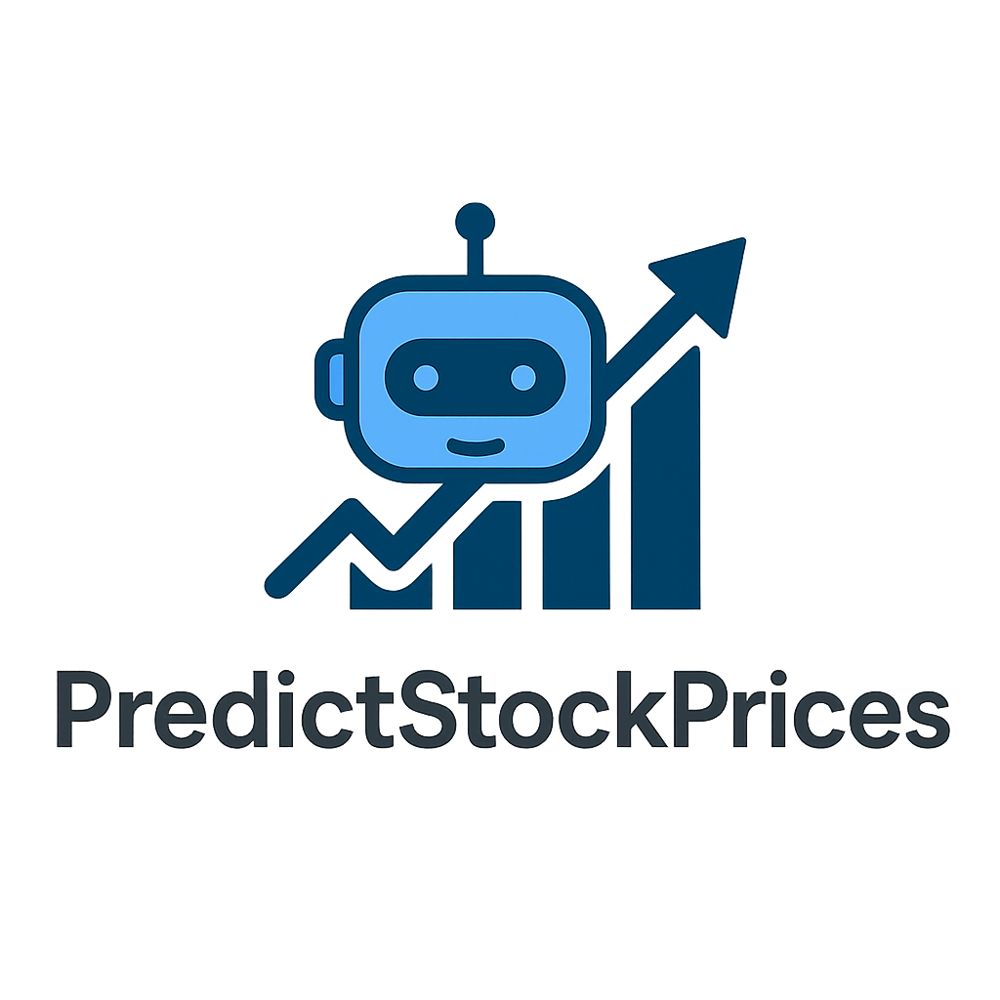
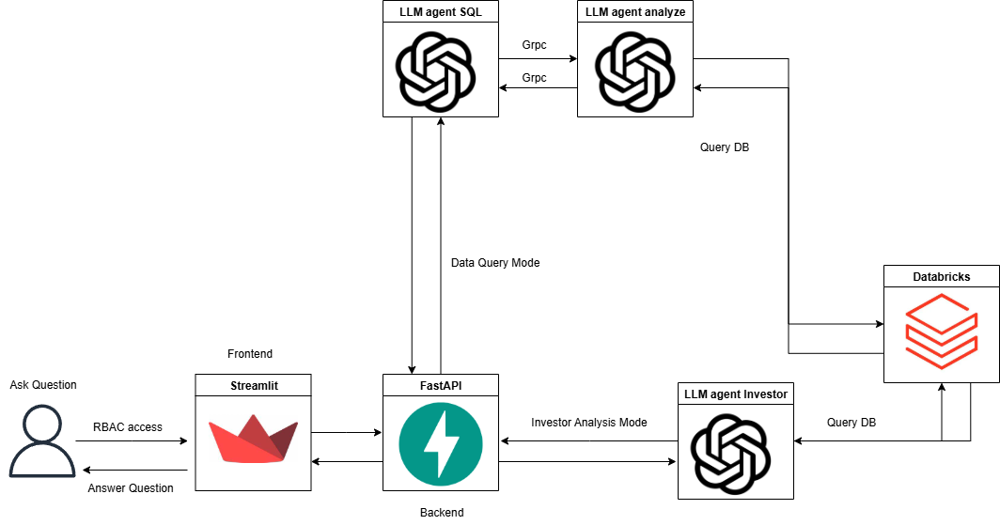
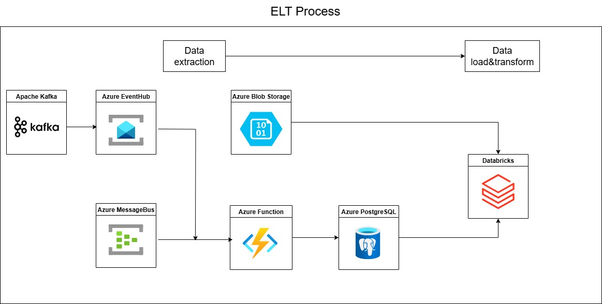
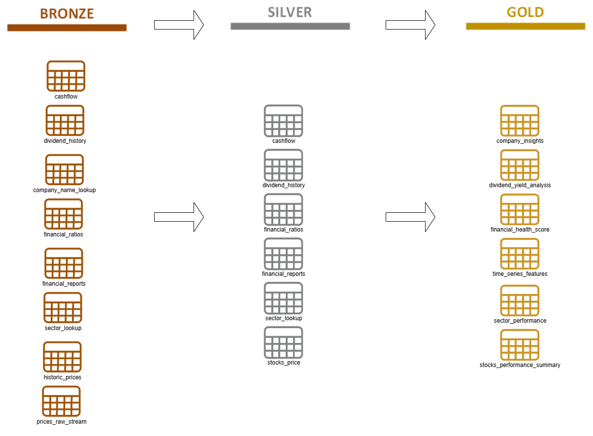

  
   
  

> **Disclaimer:** This application is for informational purposes only. It does not provide financial advice, and any analysis or recommendations should not be considered a basis for making investment decisions. Investing in financial markets involves risk, and you should consult with a qualified professional before making any investment choices.

## Application Overview

This project is an advanced **Large Language Model (LLM) chatbot** designed to provide detailed insights into stock market data. The application operates in two primary modes:

* **Data Query Mode:** Users can ask specific questions about stock data, and the LLM will provide accurate and concise answers based on the underlying information.
* **Investor Analysis Mode:** Users can request an analysis of a given stock through the lens of a **famous investor**. The chatbot can simulate the investment styles of:
    * **Benjamin Graham**
    * **Warren Buffett**
    * **Aswath Damodaran**

In this mode, the LLM provides a comprehensive response that includes a **buy/hold/sell signal**, a **confidence level** (from 0 to 100), and a **detailed reasoning** that reflects the chosen investor's philosophy.

  <h3>Application Architecture</h3>
  

 

---

### Architecture Overview

The application is built on a modular microservices architecture to ensure scalability and maintainability.

* **Frontend**: The user interface is developed with **Streamlit**, providing a clean and interactive chat experience.
* **Backend**: A **FastAPI** backend serves as the central hub, managing user requests and orchestrating communication between different components.
* **LLM Agents**: The core logic is handled by specialized LLM agents written with **Pydantic-AI**.
    * In **Investor Analysis Mode**, a single LLM agent is responsible for generating the investment signal, confidence score, and reasoning based on the chosen investor's philosophy.
    * In **Data Query Mode**, two LLM agents collaborate to fulfill the user's request. One agent translates the human-language query into a **SQL query**, and the second agent analyzes the database results and presents them to the user in a readable format.
* **Communication**: All agents communicate with each other and the backend using **gRPC**, a high-performance framework for remote procedure calls, which ensures fast and efficient data exchange.

---

## Databricks & Data Pipeline

The core of this application's data processing is a robust **Extract, Transform, Load (ETL)** pipeline built within the **Azure Databricks** environment. This pipeline is responsible for ingesting, cleaning, and structuring vast amounts of stock market data to make it accessible for the LLM.

  <h3>Process Architecture</h3>
  

### Key Technologies

* **Apache Kafka:** Used for real-time streaming ingestion of stock data.
* **Azure Blob Storage:** Serves as the raw and processed data lake, providing a scalable and cost-effective storage solution.
* **APIs:** External APIs are leveraged to pull up-to-date stock data.

### Delta Lake Architecture

The data within Databricks is structured using the **Medallion Architecture**, a multi-layered approach that ensures data quality and reusability.

* **Bronze Layer:** Raw, untransformed data ingested directly from Kafka and APIs.
* **Silver Layer:** Cleaned and refined data, where basic transformations and quality checks have been applied.
* **Gold Layer:** Aggregate and feature-engineered data, ready for consumption by the LLM and other downstream applications.

  <h3>Databricks Tables Architecture</h3>
  

---

### ToDo List

- [x] End to end data pipelines in Azure&Databricks
- [ ] Backend in FastAPI (On Going)
- [ ] Secure frontend in Streamlit (On Going)
- [ ] SQL translate Agent (On Going)
- [ ] Investor Analysis Agent (On Going)
- [ ] Analysis Agent (On Going)
- [ ] Monitoring in Langfuse